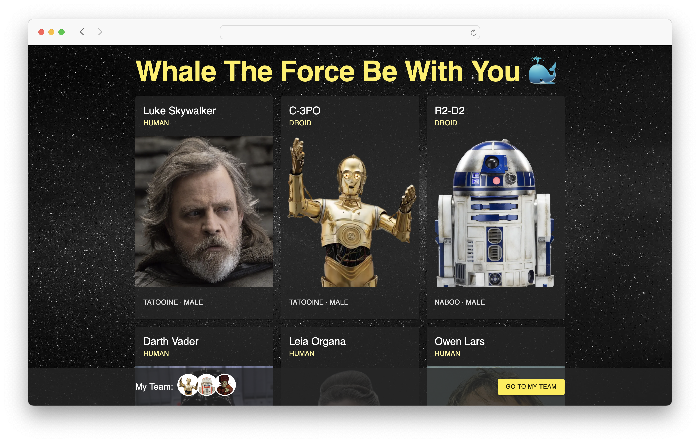
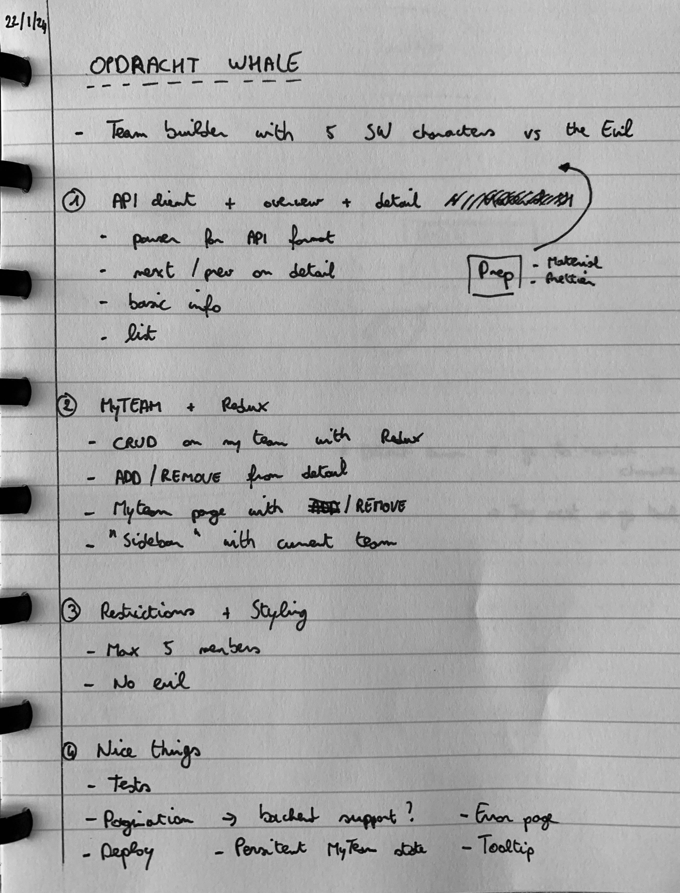
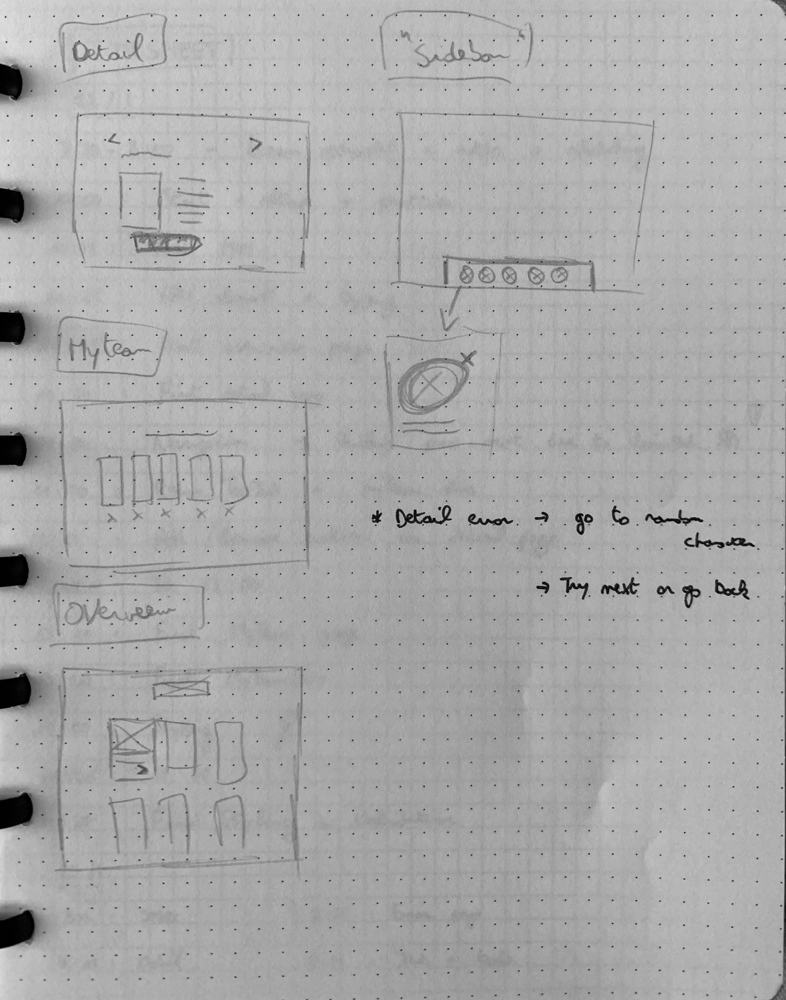
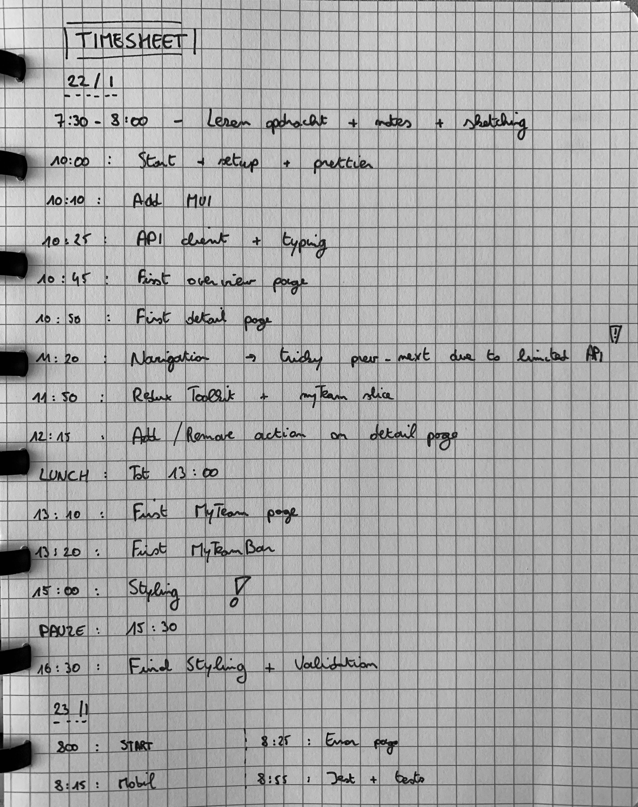

# Whale The Force Be With You 🐳

## Approach

1. API-client + overview + detail
2. MyTeam with Redux
3. Styling
4. Restrictions (max # of characters + isEvil)
5. Nice things (tests, deploy, error page)
6. Clean-up

## Implementation

**22/01**

- 07:30 - 08:00 - Read task + notes + sketching
- 10:00 - Start + setup + prettier
- 10:10 - Add MUI
- 10:25 - API client + typings
- 10:45 - Working overview page
- 10:50 - Working detail page
- 11:20 - Previous/next navigation
- 11:50 - RTK reseach, setup + myTeamSlice
- 12:15 - Add/remove action on detail
- LUNCH
- 13:00 - Restart
- 13:10 - Working myTeam page
- 13:20 - Working myTeamBar
- 15:00 - Styling
- BREAK
- 15:30 - Restart
- 16:30 - More styling + implement restrictions
- DONE

**23/01**

- 08:00 - Start
- 08:15 - Mobile styling
- 08:25 - Error detail page
- 08:55 - Jest + tests

## What I liked

- learning MUI
- theme
- work again with Redux. RKT is quite easy to setup + slice concept + little
  boilerplate

## What I struggled with

- previous/next navigation due to limited API response
  - didn't want to hard code or use an env variable for max number of characters
- thinking in MUI + available components + odd `<Grid />` component

## missing

- cleaner mobile
- pagination on overview
- better prev/next navigation
- parser for cleaning up api data + internal data format
- more tests
- persist store state to local storage

## notes

